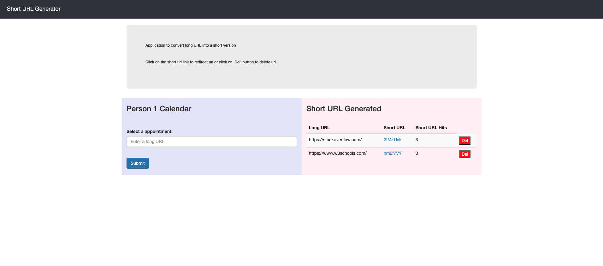

#### URL Shortcode Generator

- ###### Installation: 

  - Clone and extract project to a server
  
  - cd into project root directory
  
  - RENAME: .htaccess.sample to .htaccess
  
  - RUN: composer install
  
  - Create a database
  
  - update the database connection details in config/Database.php file
  
  - Created tables:
  
CREATE TABLE `short_urls` (
 `id` int(11) NOT NULL AUTO_INCREMENT,
 `long_url` varchar(255) COLLATE utf8_unicode_ci NOT NULL,
 `short_code` varchar(25) COLLATE utf8_unicode_ci NOT NULL,
 `hits` int(11) NOT NULL DEFAULT '0',
 `created` datetime NOT NULL,
 PRIMARY KEY (`id`)
) ENGINE=InnoDB DEFAULT CHARSET=utf8 COLLATE=utf8_unicode_ci;
  
  
- Navigate to your host domain to view/interact with the shortcode application

###### Application Screenshot

